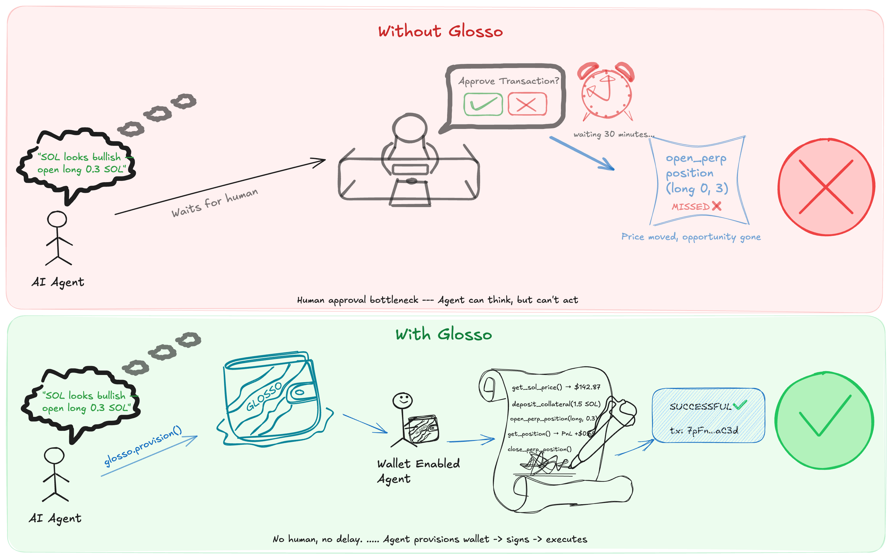

# Glosso

> *From Glossokomon (γλωσσόκομον) — the ancient Greek word for a keeper of precious things.*

**Agentic wallet infrastructure for Solana.** Glosso gives any AI agent an autonomous, production-grade Solana wallet it fully controls — no human approval loop, no key exposure, no framework lock-in.

[See illustration here](#illustration)

[](https://www.npmjs.com/package/glosso)
[](LICENSE)

---

## Quick Start

```bash
npm install -g glosso

glosso provision --mode sovereign    # create a wallet
glosso status                        # check it
```

That's it. You have an encrypted Solana wallet, a `GLOSSO.md` capability manifest in your working directory, and a devnet airdrop.

For SDK usage in your own code:

```bash
npm install glosso
```

```typescript
import { GlossoWallet } from 'glosso';

const wallet = new GlossoWallet();
const balance = await wallet.getBalance();
await wallet.send(recipient, 0.1 * 1e9);
```

---

## How It Works

Glosso's lifecycle is two phases. Operators run phase one once. Agents run phase two forever.

**Phase 1 — Provision (operator, one time)**

```bash
glosso provision --mode sovereign
```

Generates a wallet, encrypts keys, writes config to `~/.glosso/.env`, and drops a `GLOSSO.md` capability manifest into the working directory. The raw private key is never printed.

**Phase 2 — Runtime (agent, autonomous)**

The agent reads `GLOSSO.md`, discovers its tools, and operates — sign, send, trade — without human input. Changing the signing backend (sovereign → privy → turnkey) requires only a config change, never a code change.

---

## Wallet Modes

Three signing backends. Pick at provision time, switch any time. Agent code never changes.

| Mode | Key Storage | Best For |
|---|---|---|
| **Sovereign** | Encrypted locally (AES-256-GCM) | Dev, trusted servers, zero external deps |
| **Privy** | Privy TEE (Trusted Execution Environment) | Production cloud, enterprise key management |
| **Turnkey** | HSM via Turnkey API | Scale, compliance, policy controls |

```bash
glosso switch --mode privy
# Active wallet: EzwNi5jN2xTjaZRqAigXzKp4KyzcN8bXkwA1PHfckGo5
```

> See [SECURITY.md](SECURITY.md) for the full threat model — key derivation, AES-256-GCM, PBKDF2, and adapter comparison.

---

## Policy Engine

The policy engine sits between every agent action and the signing adapter. When a limit is hit, signing is refused and the agent receives a structured `PolicyViolationError` it can reason about.

```typescript
const scoped = wallet.withPolicy({
  maxSolPerTx: 0.5,
  maxSolPerDay: 3.0,
  maxTxPerHour: 5,
  allowedPrograms: [
    'dRiftyHA39MWEi3m9aunc5MzRF1JYuBsbn6VPcn33UH',  // Drift
    'JUP6LkbZbjS1jKKwapdHNy74zcZ3tLUZoi5QNyVTaV4',  // Jupiter
  ],
  activeHours: { from: 8, to: 20 },
  paused: false,
});

await scoped.send(recipient, lamports); // enforced
```

Manage policies from the CLI — changes take effect on the next agent action, no restart needed:

```bash
glosso policy set MAX_SOL_PER_TX 0.5
glosso policy set MAX_TX_PER_HOUR 10
glosso policy allow-program Jupiter
glosso policy pause                     # kill switch
glosso policy resume
glosso policy status                    # view all active limits
```

Full details: [POLICY.md](POLICY.md)

---

## Skills

Glosso's capabilities are modular. Each skill ships a `SKILL.md` manifest the agent reads at startup to discover its available tools.

| Skill | What it does |
|---|---|
| **glosso-wallet** | SOL balance, send transfers, transaction history |
| **glosso-pyth** | Real-time price feeds — SOL, BTC, ETH, USDC, JUP, BONK and more |
| **glosso-jupiter** | Token swap quotes and execution via Jupiter aggregator |

When a wallet is provisioned, `GLOSSO.md` is written to the working directory listing every installed skill and its functions. The agent reads this once at startup — no hardcoded capability lists required.

---

## CLI Reference

```bash
glosso provision --mode sovereign|privy|turnkey [--network devnet|mainnet-beta]
glosso status
glosso switch --mode <mode>

glosso logs                          # all events
glosso logs --tail 50                # last 50
glosso logs --follow                 # live tail
glosso logs --sessions               # list sessions
glosso logs --session <id>           # filter to one session

glosso monitor                       # full TUI dashboard

glosso policy status                 # view active policy
glosso policy set <KEY> <VALUE>      # set a limit
glosso policy allow-program <name>   # add to allowlist
glosso policy deny-program <name>    # remove from allowlist
glosso policy pause                  # emergency kill switch
glosso policy resume                 # resume operations
glosso policy reset-counters         # reset daily/hourly counters
```

---

## Monitoring

Every tool call, transaction, thinking step, and error is written to `~/.glosso/activity.log` as append-only JSON Lines.

**`glosso logs`** — color-coded terminal output:

```
16:37:44 [demo-sv01]  START  sovereign • 9w56ob…5sPT • devnet
16:37:44 [demo-sv01]  ROUND 1/5
16:37:44 [demo-sv01] 🔧 get_sol_price({})
16:37:44 [demo-sv01]   ✅  SOL = $142.87
16:37:44 [demo-sv01] 🔧 open_perp_position({"direction":"long","sizeSol":0.3})
16:37:44 [demo-sv01]   ✅  long 0.3 SOL  2hTnBm…z0aB  ↗ explorer
16:37:44 [demo-sv01]   ✅  closed market #0  7pFnLm…aC3d  ↗ explorer
```

**`glosso monitor`** — full-terminal Ink/React TUI with live file-watching, price sparkline, TX stats, and activity feed.


---

## Demo — Autonomous Trading Agent

A fully autonomous Drift trading agent that reads `GLOSSO.md`, discovers its tools, and executes a complete trading cycle without prompting.

**What it does:**
1. Fetches live SOL price from Pyth
2. Deposits collateral into Drift
3. Opens a SOL-PERP position based on signal
4. Monitors PnL
5. Closes the position
6. Logs every step to `~/.glosso/activity.log`

```bash
# Install and provision
npm install -g glosso
glosso provision --mode sovereign

# Clone the demo agent source
git clone https://github.com/ubadineke/glosso
cd glosso/demo && cp .env.example .env   # add your XAI_API_KEY
npm install && npx tsx src/agent.ts

# In another terminal — watch it live
glosso monitor
```

---

## Setup with OpenClaw

The fastest path for [OpenClaw](https://openclaw.dev) users:

```bash
git clone https://github.com/ubadineke/glosso.git && cd glosso && bash install.sh
```

This installs `glosso-wallet`, `glosso-pyth`, and `glosso-jupiter` into `~/.openclaw/skills/`. Then in the agent chat:

> "I need a Solana wallet."

The agent reads `SKILL.md`, asks which mode, runs provision, and reports your wallet address.

---

## Environment Variables

Section-based `.env` at `~/.glosso/.env` — only the active mode's block is read at runtime.

```bash
GLOSSO_MODE=sovereign               # sovereign | privy | turnkey
GLOSSO_NETWORK=devnet               # devnet | mainnet-beta

# ── Sovereign ────────────────────────────────────────────
GLOSSO_MASTER_SEED_ENCRYPTED=<base64>
GLOSSO_ENCRYPTION_PASSPHRASE=<passphrase>
SOVEREIGN_WALLET_ADDRESS=<public key>

# ── Privy ────────────────────────────────────────────────
PRIVY_APP_ID=<app id>
PRIVY_APP_SECRET=<secret>
PRIVY_WALLET_ID=<wallet id>
PRIVY_WALLET_ADDRESS=<address>

# ── Turnkey ───────────────────────────────────────────────
TURNKEY_API_PUBLIC_KEY=<key>
TURNKEY_API_PRIVATE_KEY=<key>
TURNKEY_ORGANIZATION_ID=<org id>
TURNKEY_WALLET_ADDRESS=<address>

# ── Agent / LLM ───────────────────────────────────────────
XAI_API_KEY=<key>                    # or OPENAI_API_KEY, ANTHROPIC_API_KEY
```

> **Tip:** Store `GLOSSO_ENCRYPTION_PASSPHRASE` in a secrets manager (Doppler, AWS Secrets Manager, Vault) and inject at runtime.

---

## Security

Sovereign mode encrypts the master seed with AES-256-GCM + PBKDF2 (100K iterations). The private key exists only in function scope during signing — it is never returned, logged, or persisted in memory.

| Threat | Protection |
|---|---|
| `.env` read without passphrase | AES-256-GCM — ciphertext is useless without the key |
| Ciphertext tampering | GCM authentication tag — modified blobs fail to decrypt |
| Passphrase brute-force | PBKDF2 with 100,000 iterations |
| Key appearing in logs | Private key is never returned — only signatures leave scope |
| Sub-wallet isolation | Hardened SLIP-0010 derivation paths |

For high-value deployments, use **Privy** (TEE-based) or **Turnkey** (HSM-based) — signing happens in hardware-isolated environments outside your application process.

Full threat model and implementation details: **[SECURITY.md](SECURITY.md)**

---

## Project Structure

```
glosso/
├── packages/
│   ├── core/           @glosso/core    — wallet adapters, signing, crypto, policy engine, logger
│   ├── cli/            @glosso/cli     — provision, status, switch, logs, monitor, policy commands
│   ├── sdk/            @glosso/sdk     — public SDK re-exporting core for consumers
│   ├── glosso/         glosso          — umbrella package (SDK + CLI in one install)
│   ├── monitor/        @glosso/monitor — Ink/React TUI dashboard
│   └── skills/
│       ├── glosso-wallet/              — SOL balance, transfers, history
│       ├── glosso-pyth/                — Pyth price feeds
│       └── glosso-jupiter/             — Jupiter swap quotes and execution
├── demo/               Reference agent — autonomous Drift trading
├── docs/               Mintlify documentation site
└── install.sh          One-line OpenClaw skill installer
```

---

## Roadmap

See [ROADMAP.md](ROADMAP.md) for the full plan.

**Shipped:** Sovereign/Privy/Turnkey adapters · unified `GlossoWallet` interface · CLI provisioning · `glosso switch` · activity logger · `glosso logs` with `--follow` and session filtering · `glosso monitor` TUI · policy engine (spend limits, rate limits, program allowlists, time windows, pause/resume) · Jupiter skill · Pyth skill · npm package (`npm install -g glosso`) · Mintlify docs

**Next up:**
<!-- - Remote secrets — `glosso provision --from-doppler` / `--from-gist` -->
- Web dashboard — browser-based equivalent of the TUI
- Multi-agent view — aggregate sessions in one monitor pane
- Additional skills — MarginFi (lending), Orca (LP), Tensor (NFTs)
- Agent memory — persist trade history for cross-session decisions

---

<a name="illustration"></a>



## Documentation

Full docs are available at **[ubadineke.mintlify.app](https://ubadineke.mintlify.app)**.

Covers Quick Start, all three wallet modes, the Policy Engine, CLI reference, skills authoring guide, and SDK API.

---

## License

MIT
